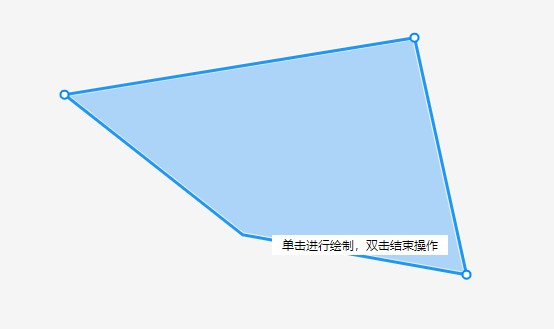
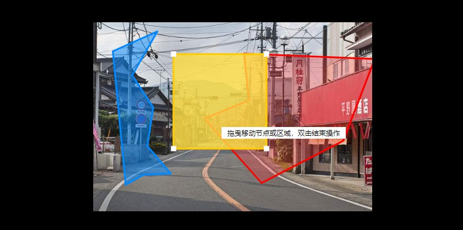
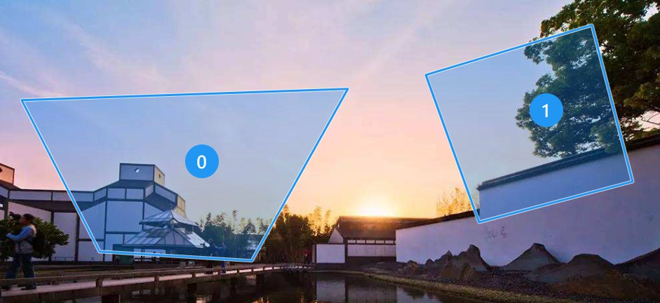

# 一个插件化的多边形标注库

常用于图片标注需求，使用截图：





`markjs`使用插件化的开发方式，包括核心的标注功能也是一个插件，默认自动注册。

其他内置插件包括：img（图片支持插件）、mouse（鼠标样式支持插件）、shape（特定形状支持插件）、order（序号插件）。此外，你也可以开发自己的插件，后面会详细介绍。

相关文章：[一个简单标注库的插件化开发实践](https://juejin.cn/post/6887799422324113422)。

## 安装

```bash
$ npm i @wanglin1994/markjs
```

## 引入

```bash
import Markjs from '@wanglin1994/markjs'
```

## 推荐用法

推荐使用该示例的配置项，区域模式，带吸附功能，可删除新增节点。

在线示例：[https://wanglin2.github.io/markjs/#demo1](https://wanglin2.github.io/markjs/#demo1)。

```vue
<template>
  <div class="container">
    <div class="markBox" ref="markBox0"></div>
    <el-button type="primary" @click="create0" :disabled="!editing0 || !!curEditMarkItem0">新增标注</el-button>
    <el-button type="primary" @click="exit0" :disabled="!isCreateMarking0">退出新增</el-button>
    <el-button type="primary" @click="getMarkData0">获取标注（控制台查看）</el-button>
    <el-button type="primary" icon="h-icon-delete" @click="deleteItem1" :disabled="!curEditMarkItem0"></el-button>
    <el-button type="primary" icon="h-icon-delete" @click="deleteAll0">删除全部</el-button>
  </div>
</template>

<script>
import Markjs from '@wanglin1994/markjs'

// 推荐用法
let mark0 = null

export default {
  data () {
    return {
      // 推荐用法
      editing0: true,
      curEditMarkItem0: null,
      isCreateMarking0: false
    }
  },
  mounted () {
    setTimeout(() => {
      // 推荐用法
      mark0 = new Markjs({
        el: this.$refs.markBox0,
        hoverActive: false,
        dbClickActive: true,
        noCrossing: true,
        enableAddPoint: true,
        area: true,
        showPen: false,
        singleClickComplete: false,
        pointType: 'circle',
        pointWidth: 2,
        pointStyle: {
          lineWidth: 2,
          strokeColor: '#0088FF',
          fillColor: '#fff'
        },
        lineType: 'borderLine',
        strokeStyle: {
          lineWidth: 5,
          strokeColor: 'rgba(255, 255, 255, 0.7)',
          frontLineWidth: 3,
          frontStrokeColor: '#2196F3'
        },
        fillColor: 'rgba(0,136,255,0.30)',
        dbClickRemovePoint: true
      })
      mark0.on('CURRENT-MARK-ITEM-CHANGE', (item) => {
        this.curEditMarkItem0 = item
      })
      mark0.on('IS-CREATE-MARKING-CHANGE', (state) =>{
        this.isCreateMarking0 = state
      })
      mark0.on('NOT-ENOUGH-END-POINTS', (state) =>{
        this.$message.warning('至少需要绘制三个端点')
      })
      mark0.on('LINE-CROSS', (item) => {
        this.$message.warning('线段不允许交叉')
      })
      mark0.on('NOT-ENOUGH-POINTS-REMOVE', (item) => {
        this.$message.warning('至少需要三个端点')
      })
    })
  },
  methods: {
    // 推荐用法
    getMarkData0() {
      console.log(mark0.getMarkData(), JSON.stringify(mark0.getMarkData()))
    },
    deleteItem0() {
      mark0.deleteMarkItem(this.curEditMarkItem0)
    },
    deleteAll0() {
      mark0.deleteAllMarkItem()
    },
    create0() {
      mark0.createMarkItem()
    },
    exit0() {
      mark0.exitCreate()
    }
  }
}
</script>

<style lang="less" scoped>
.container {  
  .markBox {
    width: 600px;
    height: 400px;
    background-color: #f5f5f5;
    margin-bottom: 10px;
  }
}
</style>
```

## 基础用法

点击新增标注按钮来创建一个新标注区域，点击进行绘制，双击结束，最终的数据以比例值返回。

1.引入`markjs`，再按需引入你需要的插件，因为文档框架限制，所以所有示例都一次性引入所有内置插件。

2.创建一个容器元素，容器元素需要有固定的宽高。

3.创建一个实例，传入特定的配置项，之后再调用特定的功能方法即可。

同时这个示例也演示了鼠标样式插件的功能，就是在特定的情况下显示特定的鼠标指针及提示信息，如果你不需要可以不引入，需要定制也可以自己开发对应的插件。

在线示例：[https://wanglin2.github.io/markjs/#demo2](https://wanglin2.github.io/markjs/#demo2)。

```vue
<template>
  <div class="container">
    <div class="markBox" ref="markBox1"></div>
    <el-button type="primary" @click="create1" :disabled="!editing1 || !!curEditMarkItem1">新增标注</el-button>
    <el-button type="primary" @click="exit1" :disabled="!isCreateMarking1">退出新增</el-button>
    <el-button type="primary" @click="getMarkData1">获取标注（控制台查看）</el-button>
    <el-button type="primary" icon="h-icon-delete" @click="deleteItem1" :disabled="!curEditMarkItem1"></el-button>
    <el-button type="primary" icon="h-icon-delete" @click="deleteAll1">删除全部</el-button>
  </div>
</template>

<script>
import Markjs from '@wanglin1994/markjs'
import mousePlugin from '@wanglin1994/markjs/src/plugins/mouse'
Markjs.use(mousePlugin)

let mark1 = null
export default {
  data () {
    return {
      editing1: true,
      curEditMarkItem1: null,
      isCreateMarking1: false,
    }
  },
  mounted () {
    mark1 = new Markjs({
      el: this.$refs.markBox1,
      hoverActive: true
    })
    mark1.on('CURRENT-MARK-ITEM-CHANGE', (item) => {
      this.curEditMarkItem1 = item
    })
    mark1.on('IS-CREATE-MARKING-CHANGE', (state) =>{
      this.isCreateMarking1 = state
    })
    mark1.on('NOT-ENOUGH-END-POINTS', (item) =>{
      this.$message.warning('至少需要绘制三个端点')
    })
  },
  methods: {
    getMarkData1() {
      console.log(mark1.getMarkData(), JSON.stringify(mark1.getMarkData()))
    },
    deleteItem1() {
      mark1.deleteMarkItem(this.curEditMarkItem1)
    },
    deleteAll1() {
      mark1.deleteAllMarkItem()
    },
    create1() {
      mark1.createMarkItem()
    },
    exit1() {
      mark1.exitCreate()
    }
  }
}
</script>

<style lang="less" scoped>
.container {  
  .markBox {
    width: 600px;
    height: 400px;
    background-color: #f5f5f5;
    margin-bottom: 10px;
  }
}
</style>
```

## 标注图片

标注图片是一个很常用的功能，所以内置了一个插件来支持，插件可以加载图片并根据图片原始尺寸来进行缩放。

如果实际绘制区域和容器大小不一致，默认会居中进行显示。

同时本示例演示了线段的交叉检测及最多能绘制的区域限制功能。

使用图片插件需要传入图片插件的参数`img`，指定图片的地址。

在线示例：[https://wanglin2.github.io/markjs/#demo3](https://wanglin2.github.io/markjs/#demo3)。

```vue
<template>
  <div class="container">
    <div class="markBox" ref="markBox2"></div>
    <el-button type="primary" @click="create2" :disabled="!editing2 || !!curEditMarkItem2">新增标注</el-button>
    <el-button type="primary" @click="exit2" :disabled="!isCreateMarking2">退出新增</el-button>
    <el-button type="primary" @click="getMarkData2">获取标注（控制台查看）</el-button>
    <el-button type="primary" icon="h-icon-delete" @click="deleteItem2" :disabled="!curEditMarkItem2"></el-button>
    <el-button type="primary" icon="h-icon-delete" @click="deleteAll2">删除全部</el-button>
  </div>
</template>

<script>
import Markjs from '@wanglin1994/markjs'
import mousePlugin from '@wanglin1994/markjs/src/plugins/mouse'
import imgPlugin from '@wanglin1994/markjs/src/plugins/img'
// 引入图片插件，图片插件需要在编辑插件之前注册，因为编辑插件已经默认注册了，且在第一项，所以图片插件需要指定插到第一项
Markjs.use(imgPlugin, 0)
Markjs.use(mousePlugin)

let mark2 = null
export default {
  data () {
    return {
      editing2: true,
      curEditMarkItem2: null,
      isCreateMarking2: false
    }
  },
  mounted () {
    mark2 = new Markjs({
      el: this.$refs.markBox2,
      hoverActive: true,
      img: require('../assets/demo.png'),
      elBg: '#000',
      max: 3,
      noCrossing: true
    })
    mark2.on('CURRENT-MARK-ITEM-CHANGE', (item) => {
      this.curEditMarkItem2 = item
    })
    mark2.on('IS-CREATE-MARKING-CHANGE', (state) =>{
      this.isCreateMarking2 = state
    })
    mark2.on('LINE-CROSS', (item) => {
      this.$message.warning('线段不允许交叉')
    })
    mark2.on('NOT-ENOUGH-END-POINTS', (item) =>{
      this.$message.warning('至少需要绘制三个端点')
    })
    mark2.on('COUNT-LIMIT', (item) =>{
      this.$message.warning('最多只能绘制三个区域')
    })
  },
  methods: {
    getMarkData2() {
      console.log(mark2.getMarkData(), JSON.stringify(mark2.getMarkData()))
    },
    deleteItem2() {
      mark2.deleteMarkItem(this.curEditMarkItem2)
    },
    deleteAll2() {
      mark2.deleteAllMarkItem()
    },
    create2() {
      mark2.createMarkItem()
    },
    exit2() {
      mark2.exitCreate()
    }
  }
}
</script>

<style lang="less" scoped>
.container {  
  .markBox {
    width: 600px;
    height: 400px;
    background-color: #f5f5f5;
    margin-bottom: 10px;
  }
}
</style>
```

## 特定形状

有时候可能需要限制特定的形状，这可以通过`shape`插件来实现，因为本人水平所限，只内置了正方形和矩形两种形状，你可以通过该插件来扩展你需要的形状支持。

同时本示例也演示了在创建新标注时可通过第二个参数传入配置项，定义填充颜色等。

在线示例：[https://wanglin2.github.io/markjs/#demo4](https://wanglin2.github.io/markjs/#demo4)。

```vue
<template>
    <div class="container" ref="container">
      <div class="markBox" ref="markBox3"></div>
      <el-button type="primary" @click="createShape3" :disabled="!editing3 || !!curEditMarkItem3">创建形状</el-button>
      <el-button type="primary" @click="exit3" :disabled="!isCreateMarking3">退出新增</el-button>
      <el-button type="primary" @click="getMarkData3">获取标注（控制台查看）</el-button>
      <el-button type="primary" icon="h-icon-delete" @click="deleteItem3" :disabled="!curEditMarkItem3"></el-button>
      <el-button type="primary" icon="h-icon-delete" @click="deleteAll3">删除全部</el-button>
    </div>  
</template>

<script>
import Markjs from '@wanglin1994/markjs'
import mousePlugin from '@wanglin1994/markjs/src/plugins/mouse'
import shapePlugin from '@wanglin1994/markjs/src/plugins/shape'
Markjs.use(shapePlugin)
Markjs.use(mousePlugin)

let mark3 = null
export default {
  data () {
    return {
      editing3: true,
      curEditMarkItem3: null,
      isCreateMarking3: false
    }
  },
  mounted () {
    mark3 = new Markjs({
      el: this.$refs.markBox3,
      hoverActive: true
    })
    mark3.on('CURRENT-MARK-ITEM-CHANGE', (item) => {
      this.curEditMarkItem3 = item
    })
    mark3.on('IS-CREATE-MARKING-CHANGE', (state) =>{
      this.isCreateMarking3 = state
    })
    mark3.on('NOT-ENOUGH-END-POINTS', (item) =>{
      this.$message.warning('至少需要绘制三个端点')
    })
  },
  methods: {
    getMarkData3() {
      console.log(mark3.getMarkData(), JSON.stringify(mark3.getMarkData()))
    },
    deleteItem3() {
      mark3.deleteMarkItem(this.curEditMarkItem3)
    },
    deleteAll3() {
      mark3.deleteAllMarkItem()
    },
    exit3() {
      mark3.exitCreate()
    },
    createShape3() {
      // 不再使用createMarkItem方法，而是使用createShapeMarkItem方法来创建指定形状
      mark3.createShapeMarkItem('square', {
        fillColor: 'rgba(250,50,57,0.30)'
      })
    }
  }
}
</script>

<style lang="less" scoped>
.container {  
  .markBox {
    width: 600px;
    height: 400px;
    background-color: #f5f5f5;
    margin-bottom: 10px;
  }
}
</style>
```

## 单独编辑

默认情况下激活某个区域进行标注时其他非激活标注仍然会存在，可以通过设置属性`single`为`true`来控制只显示激活的那个标注区域。

在线示例：[https://wanglin2.github.io/markjs/#demo5](https://wanglin2.github.io/markjs/#demo5)。

```vue
<template>
  <div class="container">
    <div class="markBox" ref="markBox4"></div>
    <el-button type="primary" @click="create4" :disabled="!editing4 || !!curEditMarkItem4">新增标注</el-button>
    <el-button type="primary" @click="exit4" :disabled="!isCreateMarking4">退出新增</el-button>
    <el-button type="primary" @click="getMarkData4">获取标注（控制台查看）</el-button>
    <el-button type="primary" icon="h-icon-delete" @click="deleteItem4" :disabled="!curEditMarkItem4"></el-button>
    <el-button type="primary" icon="h-icon-delete" @click="deleteAll4">删除全部</el-button>
  </div>
</template>

<script>
import Markjs from '@wanglin1994/markjs'
import mousePlugin from '@wanglin1994/markjs/src/plugins/mouse'
Markjs.use(mousePlugin)

let mark4 = null
export default {
  data () {
    return {
      editing4: true,
      curEditMarkItem4: null,
      isCreateMarking4: false,
    }
  },
  mounted () {
    mark4 = new Markjs({
      el: this.$refs.markBox4,
      hoverActive: true,
      single: true// 开启单独编辑模式
    })
    mark4.on('CURRENT-MARK-ITEM-CHANGE', (item) => {
      this.curEditMarkItem4 = item
    })
    mark4.on('IS-CREATE-MARKING-CHANGE', (state) =>{
      this.isCreateMarking4 = state
    })
    mark4.on('NOT-ENOUGH-END-POINTS', (item) =>{
      this.$message.warning('至少需要绘制三个端点')
    })
  },
  methods: {
    getMarkData4() {
      console.log(mark4.getMarkData(), JSON.stringify(mark4.getMarkData()))
    },
    deleteItem4() {
      mark4.deleteMarkItem(this.curEditMarkItem4)
    },
    deleteAll4() {
      mark4.deleteAllMarkItem()
    },
    create4() {
      mark4.createMarkItem()
    },
    exit4() {
      mark4.exitCreate()
    }
  }
}
</script>

<style lang="less" scoped>
.container {  
  .markBox {
    width: 600px;
    height: 400px;
    background-color: #f5f5f5;
    margin-bottom: 10px;
  }
}
</style>
```

## 综合示例

这个示例演示了大部分的配置项。

初始设通过`readonly`为`true`设为只读模式，通过方法开启为编辑模式。

回显了部分数据，包括特定形状，回显可设置单独的样式。

在线示例：[https://wanglin2.github.io/markjs/#demo6](https://wanglin2.github.io/markjs/#demo6)。

```vue
<template>
  <div class="container">
    <div class="markBox" ref="markBox5"></div>
    <el-button type="primary" @click="edit5">{{
      editing5 ? "切换到只读模式" : "切换到编辑模式"
    }}</el-button>
    <el-button
      type="primary"
      @click="create5"
      :disabled="!editing5 || !!curEditMarkItem5"
      >新增标注</el-button
    >
    <el-button
      type="primary"
      @click="createShape5"
      :disabled="!editing5 || !!curEditMarkItem5"
      >创建形状</el-button
    >
    <el-button type="primary" @click="exit5" :disabled="!isCreateMarking5"
      >退出新增</el-button
    >
    <el-button type="primary" @click="getMarkData5"
      >获取标注（控制台查看）</el-button
    >
    <el-button
      type="primary"
      icon="el-icon-delete"
      @click="deleteItem5"
      :disabled="!curEditMarkItem5"
    ></el-button>
    <el-button type="primary" icon="el-icon-delete" @click="deleteAll5"
      >删除全部</el-button
    >
  </div>
</template>

<script>
import Markjs from "@wanglin1994/markjs";
import mousePlugin from "@wanglin1994/markjs/src/plugins/mouse";
import imgPlugin from "@wanglin1994/markjs/src/plugins/img";
import shapePlugin from "@wanglin1994/markjs/src/plugins/shape";
Markjs.use(imgPlugin, 0);
Markjs.use(shapePlugin);
Markjs.use(mousePlugin);

let mark5 = null;
export default {
  data() {
    return {
      // 综合示例
      editing5: false,
      curEditMarkItem5: null,
      isCreateMarking5: false,
    };
  },
  mounted() {
    setTimeout(() => {
      mark5 = new Markjs({
        el: this.$refs.markBox5,
        value: [
          {
            data: "区域1",
            pointArr: [
              { x: 0.5409663865546218, y: 0.16607004643962847 },
              { x: 1.009453781512605, y: 0.19393382352941177 },
              { x: 0.8960084033613446, y: 0.6273703560371517 },
              { x: 0.6039915966386554, y: 0.8502805727554179 },
              { x: 0.39810924369747897, y: 0.5097232972136223 },
              { x: 0.5577731092436975, y: 0.4137480650154799 },
            ],
            fillColor: "rgba(250,50,57,0.30)",
            strokeStyle: { strokeColor: "red" },
            pointStyle: { fillColor: "#FFCC00", strokeColor: "#FFCC00" },
          },
          {
            data: null,
            pointArr: [
              { x: 0.0703781512605042, y: 0.15368614551083593 },
              { x: 0.23004201680672268, y: 0.04842298761609907 },
              { x: 0.13970588235294118, y: 0.28062113003095973 },
              { x: 0.21533613445378152, y: 0.4508997678018576 },
              { x: 0.19432773109243698, y: 0.655234133126935 },
              { x: 0.27836134453781514, y: 0.8007449690402477 },
              { x: 0.1796218487394958, y: 0.806936919504644 },
              { x: 0.11659663865546219, y: 0.8595684984520123 },
            ],
          },
          {
            data: null,
            shape: "square",
            pointArr: [
              { x: 0.37, y: 0.2025 },
              { x: 0.7033333333333334, y: 0.2025 },
              { x: 0.7033333333333334, y: 0.7025 },
              { x: 0.37, y: 0.7025 },
            ],
            fillColor: "rgba(255,223,66,0.80)",
            strokeStyle: { strokeColor: "#FFCC00" },
          },
        ],
        showPoint: true,
        pointType: "square",
        pointWidth: 3,
        pointStyle: {
          lineWidth: 3,
          strokeColor: "#fff",
          fillColor: "#fff",
        },
        max: 5,
        hoverActive: true,
        readonly: true,
        showPen: true,
        single: false,
        noCrossing: true,
        img: require("../assets/demo.png"),
        elBg: "#000",
        bg: "#fff",
      });
      mark5.on("CURRENT-MARK-ITEM-CHANGE", (item) => {
        this.curEditMarkItem5 = item;
      });
      mark5.on("IS-CREATE-MARKING-CHANGE", (state) => {
        this.isCreateMarking5 = state;
      });
      mark5.on("LINE-CROSS", (item) => {
        this.$message.warning("线段不允许交叉");
      });
      mark5.on("NOT-ENOUGH-END-POINTS", (item) => {
        this.$message.warning("至少需要绘制三个端点");
      });
      mark5.on("COUNT-LIMIT", (item) => {
        this.$message.warning("最多只能绘制三个区域");
      });
    });
  },
  methods: {
    edit5() {
      if (this.editing5) {
        let succ = mark5.disableEdit();
        if (!succ) {
          this.$message.warning("请先完成编辑");
          return;
        }
      } else {
        mark5.enableEdit();
      }
      this.editing5 = !this.editing5;
    },
    getMarkData5() {
      console.log(mark5.getMarkData(), JSON.stringify(mark5.getMarkData()));
    },
    deleteItem5() {
      mark.deleteMarkItem(this.curEditMarkItem5);
    },
    deleteAll5() {
      mark5.deleteAllMarkItem();
    },
    create5() {
      mark5.createMarkItem({
        data: "新标注",
        fillColor: "rgba(155,224,255,0.27)",
      });
    },
    exit5() {
      mark5.exitCreate();
    },
    createShape5() {
      mark5.createShapeMarkItem("square");
    },
  },
};
</script>

<style lang="less" scoped>
.container {  
  .markBox {
    width: 600px;
    height: 400px;
    background-color: #f5f5f5;
    margin-bottom: 10px;
  }
}
</style>
```

## API

```js
import Markjs from 'Markjs'
```

### 1.类

#### 静态属性

| 参数  | 说明                               | 类型   | 可选值 | 默认值 |
| ----- | ---------------------------------- | ------ | ------ | ------ |
| pluginList | 插件列表 | Array | —      | [] |

```js
console.log(Markjs.pluginList)
```

#### 静态方法

| 方法名  | 说明                               | 参数 |
| ----- | ---------------------------------- | ------ |
| use | 注册插件 | plugin（插件函数）, index（可选，注册位置，默认是添加在数组末尾，可通过该索引来控制插入的位置） |

```js
import imgPlugin from '@wanglin1994/markjs/src/plugins/img'
Markjs.use(imgPlugin, 0)// edit插件默认为第一个，通过设置为0来插入到edit插件之前
```

### 2.实例

```js
let mark = new Markjs(opt)
```

#### 配置参数opt

【如果使用了某个插件，该插件的特定配置参数也是通过该对象进行传入！！】。

| 参数  | 说明                               | 类型   | 可选值 | 默认值 |
| ----- | ---------------------------------- | ------ | ------ | ------ |
| el | 容器元素，dom元素或选择器字符串 | Object/String | —      |  |
| dbClickTime | 因为要检测双击，所以单击是有延时的，这个属性用来控制检测双击间隔的时间，即如果在该时间内鼠标点击了两次则认为是双击事件，单位ms | Number | —      | 200 |
| mobile（1.0.18+） | 是否开启移动端模式，开启后会使用触摸事件来代替鼠标事件 | Boolean |  | false |

#### mark实例属性

| 名称  | 说明                               | 类型   | 可选值 | 默认值 |
| ----- | ---------------------------------- | ------ | ------ | ------ |
| opt | 配置参数对象 | Object | —      |  |
| el | 容器元素 | Object/String | —      |  |
| elRectInfo | 容器元素的尺寸信息 | Object | —      |  |
| canvasEle | 绘图元素 | DOM Object | —      |  |
| canvasEleRectInfo | 绘图元素的尺寸信息 | Object | —      |  |
| ctx | 绘图上下文 | Object | —      |  |
| observer | 发布订阅对象 | Object | —      |  |

#### mark实例事件

| 事件  | 说明                               | 回调函数参数 |
| ----- | ---------------------------------- | ------ |
| CLICK | 画布区域的鼠标单击事件 | e（事件对象） |
| DOUBLE-CLICK | 画布区域的鼠标双击事件 | e（事件对象） |
| MOUSEDOWN | 画布区域的鼠标按下事件 | e（事件对象） |
| MOUSEMOVE | 画布区域的鼠标移动事件 | e（事件对象） |
| MOUSEUP | 鼠标松开事件 | e（事件对象） |
| MOUSEENTER | 鼠标移入画布区域内事件 | e（事件对象） |
| MOUSELEAVE | 鼠标移出画布区域内事件 | e（事件对象） |
| WINDOW-CLICK | window窗口的单击事件 | e（事件对象） |
| DESTORY | 实例销毁事件 |  |
| UPDATED_OPT（1.0.18+） | 使用updateOpt方法更新配置后触发该事件 | opt（新配置） |
| PLUGINS_LOADED（1.0.18+） | 插件加载完成时触发，可在该回调里获取到完整可用的实例对象，否则可能有些由插件提供的方法或属性获取不到 |  |

#### mark实例方法

| 方法名  | 说明                               | 参数 |
| ----- | ---------------------------------- | ------ |
| emit（1.0.18+） | 触发事件 | event（事件名称）, data（数据） |
| on | 监听事件，返回参数为一个token，用来解除事件监听 | event（事件名称）, callback（回调函数） |
| off | 解除监听事件 | token（监听事件时返回的token） |
| destroy | 销毁实例 |  |
| clearCanvas | 清除绘图画布 |  |
| toCanvasPos | 鼠标坐标转为相对绘图画布的坐标  | e（事件对象或{clientX, clientY}） |
| updateOpt（1.0.18+） | 更新配置，比如要动态修改绘制的颜色属性等 | newOpt（要更新的配置，会和现有配置进行merge） |

### 3.编辑插件edit

编辑插件为核心插件，自动进行注册。该插件的配置参数也是通过实例化`Markjs`时进行传入。

#### 配置参数

| 参数  | 说明                               | 类型   | 可选值 | 默认值 |
| ----- | ---------------------------------- | ------ | ------ | ------ |
| value | 回显的标注区域数据，对象数组，对象的字段见表3-1 | Array | —      | [] |
| lineType | 线段类型 | line（普通线段）、borderLine（带边框的线段）、custom（自定义绘图方法），带边框的线段实现方式为绘制叠加的上下两条线段，下面的那条宽度较宽，上面的宽度较窄，当颜色设置的不一样时则会出现线段的样式，上面较窄的线段的样式同样见表3-2 | —      | line |
| customRenderLine | 自定义绘制线段的方法，当lineType为custom时需要提供，回调参数为当前标注对象的实例 |  | —      |  |
| strokeStyle | 标注区域轮廓样式，对象格式，字段见表3-2 | Object | —      |  |
| pointStyle | 标注区域顶点样式，对象格式，字段见表3-3 | Object | —      |  |
| fillColor | 标注区域填充颜色 | String | —      | rgba(0, 136, 255, 0.5) |
| showPoint | 是否绘制端点 | Boolean | —      | true |
| pointType | 顶点形状 | String | square（正方形）、circle（圆形） | square |
| pointWidth | 顶点的宽度，正方形为边长的一半、圆形为半径 | Number | —      | 3 |
| customRenderPoint | 自定义绘制顶点的方法，入参（ctx, x, y, onlyPath, pointStyle），分别为：ctx（canvas绘图上下文）、x,y（中心点的位置）、onlyPath（为true代表用于检测点是否在该顶点路径内时调用，此时不应该实际绘制出来，只要绘制路径即可）、pointStyle（顶点样式） |  | —      |  |
| max | 允许创建的标注区域数量限制，默认-1，不限制 | Number | —      | -1 |
| hoverActive | 鼠标滑过对象时显示可激活状态 | Boolean | —      | false |
| readonly | 是否只读，不允许编辑，可调用方法开启编辑状态 | Boolean | —      | false |
| single | 是否激活编辑某个区域时隐藏其他所有区域，注意这两种在交互细节上会有一点区别 | Boolean | —      | false |
| noCrossing | 是否禁止某个标注对象自身线段交叉，和其他标注对象还是可以交叉的 | Boolean | —      | false |
| dbClickRemovePoint | 是否允许双击顶点删除该顶点 | Boolean | —      | false |
| area | 区域编辑模式，即从始至终都会显示为一个闭合的图形 | Boolean | —      | false |
| adsorbent | 是否开启吸附效果 | Boolean | —      | true |
| adsorbentNum | 吸附的距离，即距离小于等于该值时会进行吸附，单位px | Number | —      | 5 |
| adsorbentLine | 是否允许吸附到线段上 | Boolean | —      | true |
| dbClickActive | 是否双击激活标注对象，默认为单击激活 | Boolean | —      | false |
| singleClickComplete | 默认情况下，双击结束编辑，如果该值设为true，除了新增创建期间外的编辑下如果单击了其他区域也可以结束编辑，设为false，即只允许双击结束编辑 | Boolean | —      | true |

##### 表3-1 标注区域对象格式

| 字段名  | 说明                               | 类型   | 可选值 | 默认值 |
| ----- | ---------------------------------- | ------ | ------ | ------ |
| data | 附加数据，你需要存储的任何数据 | Any | —      | null |
| pointArr | 区域顶点坐标数据，对象数组，对象格式为：{x,y}，为比例坐标，即x为相对于绘图区域宽的比例，y为相对于绘图区域高的比例 | Array | —      | [] |
| strokeStyle | 标注区域轮廓样式，对象格式，字段见表3-2 | Object | —      |  |
| pointStyle | 标注区域顶点样式，对象格式，字段见表3-3 | Object | —      |  |
| fillColor | 标注区域填充颜色 | String | —      | rgba(0, 136, 255, 0.5) |

##### 表3-2 strokeStyle样式对象格式

| 字段名  | 说明                               | 类型   | 可选值 | 默认值 |
| ----- | ---------------------------------- | ------ | ------ | ------ |
| lineWidth | 线条宽度 | Number | —      | 3 |
| strokeColor | 线条颜色 | String | —      | rgba(0, 136, 255, 1) |
| lineJoin | 线条末端样式 | String | bevel（斜角）、round（圆角）、miter（尖角） | round |
| frontLineWidth | 当lineType为borderLine时配置，线条宽度 | Number | —      | 3 |
| frontStrokeColor | 当lineType为borderLine时配置，线条颜色 | String | —      | rgba(0, 136, 255, 1) |
| frontLineJoin | 当lineType为borderLine时配置，线条末端样式 | String | bevel（斜角）、round（圆角）、miter（尖角） | round |

##### 表3-3 pointStyle样式对象格式

| 字段名  | 说明                               | 类型   | 可选值 | 默认值 |
| ----- | ---------------------------------- | ------ | ------ | ------ |
| lineWidth | 线条宽度 | Number | —      | 3 |
| strokeColor | 线条颜色 | String | —      | rgba(0, 136, 255, 1) |
| fillColor | 填充颜色 | String | —      | rgba(0, 136, 255, 0.5) |

#### 实例事件

| 事件  | 说明                               | 回调函数参数 |
| ----- | ---------------------------------- | ------ |
| CURRENT-MARK-ITEM-CHANGE | 当前激活标注对象变化时触发 | item（当前激活的标注对象） |
| HOVER-ITEM | 鼠标移到某个标注对象区域内时触发 | inPathItem（当前移入的标注对象）, curEditingMarkItem（当前激活的标注对象），allInItems（路径包含当前该点的所有标注对象）, e（事件对象），inPointIndex（移到了当前移入的标注对象的某个顶点的索引，如果不在顶点上为-1） |
| COMPLETE-EDIT-ITEM | 双击完成绘制时触发 | curEditingMarkItem（当前激活的标注对象）, e（事件对象） |
| IS-CREATE-MARKING-CHANGE | 当前是否在创建标注中的状态变化时触发，只在标注仍未闭合时的创建中触发，不包括闭合后的编辑 | state（状态） |
| DELETE-MARKING-ITEM | 删除某个标注时触发 | item（删除的那个标注对象），index（删除的标注的索引） |
| DELETE-ALL-MARKING-ITEM | 删除全部标注时触发 |  |
| COMPLETE-CREATE-ITEM | 新标注创建完成时触发 | curEditingMarkItem（当前创建完成的标注对象）, e（事件对象） |
| LINE-CROSS | 检测到线段交叉时触发 | curEditingMarkItem（当前激活的标注对象） |
| NOT-ENOUGH-END-POINTS | 双击闭合路径时如果顶点数量不足3个时触发 | curEditingMarkItem（当前激活的标注对象） |
| NOT-ENOUGH-POINTS-REMOVE | 双击删除顶点时如果顶点数量不足3个时触发 | curEditingMarkItem（当前激活的标注对象） |
| COUNT-LIMIT | 创建新标注时如果数量超出限制时触发 | curEditingMarkItem（当前激活的标注对象） |

#### 实例方法

| 方法名  | 说明                               | 参数 |
| ----- | ---------------------------------- | ------ |
| getState | 获取当前一些状态的值，返回一个对象，见表3-5 |  |
| getMarkData | 获取标注点位数据，返回一个对象，有两个字段，data（创建对象时你添加的附加数据）、pointArr（标注区域顶点坐标数组，为比例数据） |  |
| enableEdit | 开启编辑模式 |  |
| disableEdit | 开启只读模式，成功返回true，返回false代表当前有正在编辑中的对象，不能结束编辑 |  |
| deleteMarkItem | 删除指定标注对象，删除成功返回true | item（要删除的标注对象） |
| deleteAllMarkItem | 删除所有标注对象 |  |
| reset | 清除所有标注区域的鼠标滑入状态、激活状态，清除当前的激活元素 |  |
| createMarkItem | 创建新标注区域，即使当前状态为可编辑状态，也需要调用该方法后才能在画布上创建新区域，每次创建一个新标注区域时都需要调用一次该方法，成功返回true，返回false代表不能创建新标注 | opt（对象格式，包括表3-1的所有字段） |
| exitCreate | 取消/退出创建，`createMarkItem`后可通过调用该方法来结束创建，`single`为true的情况下激活了某个区域后想要退出激活时可以调用`reset`方法 |  |

##### 表3-5 getState返回的状态对象格式

| 字段名  | 说明                               |
| ----- | ---------------------------------- |
| markItemList | 当前存在的标注对象列表 |
| curEditingMarkItem | 当前激活的标注对象 |
| isReadonly | 是否是只读状态 |
| isCreateMarking | 是否正在创建新标注中，不包括闭合后的编辑 |

### 4.图片支持插件img

当你需要标注图片时可以引入该插件，该插件会根据图片的实际宽高来进行等比例缩放绘图区域，并显示图片，如果最终绘图区域和容器宽高不一致会自动居中。

图片支持插件需要手动引入注册，且要在编辑插件edit之前注册。

```js
import Markjs from '@wanglin1994/markjs'
import imgPlugin from '@wanglin1994/markjs/src/plugins/img'
Markjs.use(imgPlugin, 0)
```

#### 配置参数

| 参数  | 说明                               | 类型   | 可选值 | 默认值 |
| ----- | ---------------------------------- | ------ | ------ | ------ |
| img | 图片地址，必填 | String | —      |  |
| elBg | 容器的背景颜色 | String | —      |  |
| bg | 画布的背景颜色 | String | —      |  |

#### 实例事件

| 事件名  | 说明                               | 回调函数参数   |
| ----- | ---------------------------------- | ------ |
| imgLoadError | 图片加载失败时触发 | e（错误对象） |

#### 实例属性

| 属性名  | 说明                               |
| ----- | ---------------------------------- |
| image | 图片对象 |
| ratio | 图片实际的宽高与容器宽高的比例 |

### 5.鼠标样式支持插件mouse

当需要鼠标在特定状态显示特定的样式时可以使用该插件，该插件需要手动引入注册。

```js
import Markjs from '@wanglin1994/markjs'
import mousePlugin from '@wanglin1994/markjs/src/plugins/mouse'
Markjs.use(mousePlugin)
```

#### 配置参数

| 参数  | 说明                               | 类型   | 可选值 | 默认值 |
| ----- | ---------------------------------- | ------ | ------ | ------ |
| cursorTips | 提示信息，对象，格式见表5-1 | Object | —      |  |
| showPen | 否显示鼠标指针画笔 | Boolean | —      | true |
| penImg | 自定义鼠标指针图片地址 | String | —      |  |

##### 表5-1 提示信息cursorTips对象格式

| 字段名  | 说明                               | 默认值 |
| ----- | ---------------------------------- | ------ |
| START | 正在创建一个新标注对象时未闭合时鼠标显示的文字 | 单击进行绘制，双击结束操作 |
| EDITING | 移入当前激活对象区域内时鼠标显示的文字 | 拖曳移动节点或区域，双击结束操作 |
| EDITING_POINT | 移入当前激活对象区域内的顶点时鼠标显示的文字，当dbClickRemovePoint设为true才有效 | 拖拽移动节点，修改区域边界，双击删除节点 |
| HOVER | 当前没有激活对象时移入某个标注对象时鼠标显示的文字 | 单击激活该区域并进入编辑状态 |

### 6.特定形状插件shape

当你需要创建一个特定形状的标注对象时可以使用该插件，该插件需要手动引入注册。

因为本人水平所限，只内置了正方形和矩形两种图形，你可以基于`shape`配置参数来创建你需要的特定图形。

```js
import Markjs from '@wanglin1994/markjs'
import shapePlugin from '@wanglin1994/markjs/src/plugins/shape'
Markjs.use(shapePlugin)
```

#### 配置参数

| 参数  | 说明                               | 类型   | 可选值 | 默认值 |
| ----- | ---------------------------------- | ------ | ------ | ------ |
| shape | 形状扩展配置，可以通过该对象来扩展你自己需要的特定形状，目前只内置了正方形和矩形两种。对象格式，每个字段为一个特定形状，如：{square: shapeConfig, triangle: shapeConfig }，字段名为形状的名称，形状的配置对象shapeConfig字段见表6-1 | Object | —      |  |

##### 表6-1 shapeConfig形状对象字段格式

| 方法名  | 说明                               | 参数   |
| ----- | ---------------------------------- | ------ |
| create | 当调用`createShapeMarkItem`方法创建新的特定对象时会调用该方法来初始显示一个指定形状，需要返回一个`pointArr`数组，字段可见表3-1里的`pointArr`，所以简单来说，你需要返回一个形状的初始坐标数组 | canvasEleRectInfo（画布区域的尺寸信息） |
| update | 当鼠标拖动某个端点时会调用该方法，你需要在该方法内更新当前标注对象的`instance.pointArr`坐标数据来更新维护当前特定形状 | instance（当前标注对象）, x（当前鼠标指针相对于画布的x坐标）, y（当前鼠标指针相对于画布的y坐标），app（mark实例对象1.0.18+） |

#### 实例方法

| 方法名              | 说明                                                   | 参数                                                         |
| ------------------- | ------------------------------------------------------ | ------------------------------------------------------------ |
| createShapeMarkItem | 创建一个指定形状的标注对象，用于代替createMarkItem方法 | shape（要创建的形状，目前内置的只有两种：square正方形、rectangle矩形）、_opt（配置项，更多参数见【3.编辑插件edit】的配置参数） |

### 7.序号插件order

序号插件会给某个标注区域显示一个编号。



```js
import Markjs from '@wanglin1994/markjs'
import orderPlugin from '@wanglin1994/markjs/src/plugins/order'
Markjs.use(orderPlugin)
```

#### 配置参数

| 参数  | 说明                               | 类型   | 可选值 | 默认值 |
| ----- | ---------------------------------- | ------ | ------ | ------ |
| order | 配置参数对象，字段见表7-1 | Object | —      |  |

#### 表7-1 order对象字段格式

| 字段名  | 说明                               | 类型   | 可选值 | 默认值 |
| ----- | ---------------------------------- | ------ | ------ | ------ |
| color | 序号颜色 | String |  | #fff |
| background | 序号背景颜色 | String |  | #2196F3 |
| fontSize | 序号字号 | Number |  | 24 |
| width | 序号的宽高 | Number |  | 48 |
| class | 自定义css类名，设置了类名内部就只会设置基本的定位属性，其他样式属性需要你自己来设置 | String |  |  |

### 8.插件开发

如果以上仍然不能满足你的要求的话那么你可以考虑开发自己的插件，如果是的话你可能首先看一下源码，特别是内置的插件源码，可以参考来进行开发，幸运的是源码并不复杂，甚至还有点简单。

一个插件就是一个函数，插件会在实例创建的最后进行循环调用，值得注意的是通过`promise`来进行链式调用的，这么设计的原因是因为某个插件的注册过程可能是异步的，但是后面的插件又必须等待它注册完毕，所以插件函数需要返回一个`promise`，且只能被`resolve`，不能被`reject`。

插件的注册其实就是调用该插件函数，入参有两个：`this`（当前mark实例）, `utils`（工具函数对象），你可以基于当前实例的一系列属性、方法来进行功能开发。

当你的某个属性或者方法需要暴露给实例对象来提供访问时，可以把它以属性的方式添加给`this`。

如果某个属性或者方法通过`this`访问不到而你又需要，可以提交`issue`，我会及时添加。

插件开发完毕，你可以将它发布到`npm`，供其他人使用。
